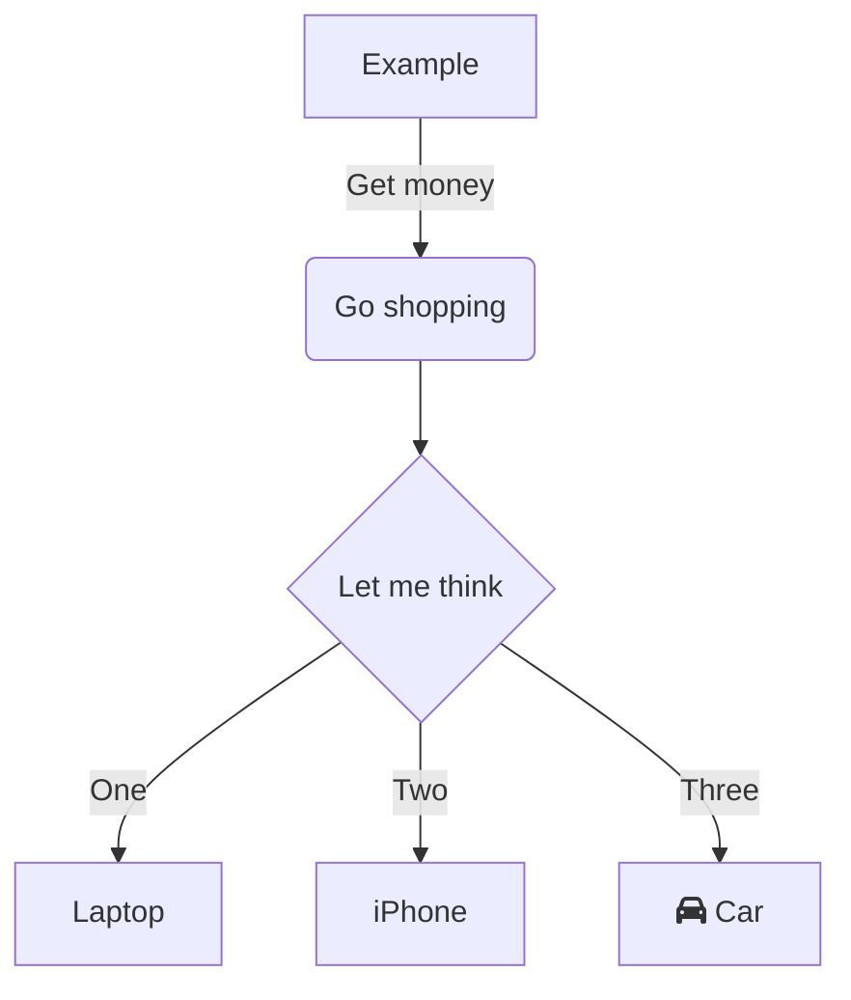

<p align="center">
  <a href="http://nestjs.com/" target="blank"></a>
</p>

[circleci-image]: https://img.shields.io/circleci/build/github/nestjs/nest/master?token=abc123def456
[circleci-url]: https://circleci.com/gh/nestjs/nest

  <p align="center">A progressive <a href="http://nodejs.org" target="_blank">Node.js</a> framework for building efficient and scalable server-side applications.</p>
    <p align="center">
<a href="https://www.npmjs.com/~nestjscore" target="_blank"></a>
<a href="https://www.npmjs.com/~nestjscore" target="_blank"></a>
<a href="https://www.npmjs.com/~nestjscore" target="_blank"></a>
<a href="https://circleci.com/gh/nestjs/nest" target="_blank"></a>
<a href="https://coveralls.io/github/nestjs/nest?branch=master" target="_blank"></a>
<a href="https://discord.gg/G7Qnnhy" target="_blank"></a>
<a href="https://opencollective.com/nest#backer" target="_blank"></a>
<a href="https://opencollective.com/nest#sponsor" target="_blank"></a>
  <a href="https://paypal.me/kamilmysliwiec" target="_blank"></a>
    <a href="https://opencollective.com/nest#sponsor"  target="_blank"></a>
  <a href="https://twitter.com/nestframework" target="_blank"></a>
</p>
  <!--[](https://opencollective.com/nest#backer)
  [](https://opencollective.com/nest#sponsor)-->

## Description

[Nest](https://github.com/nestjs/nest) framework TypeScript starter repository.

## Installation

```bash
$ npm install
```

## Running the app

```bash
# development
$ npm run start

# watch mode
$ npm run start:dev

# production mode
$ npm run start:prod
```

## Test

```bash
# unit tests
$ npm run test

# e2e tests
$ npm run test:e2e

# test coverage
$ npm run test:cov
```

##### O que é Nest.js?

- Framework Node Fullstack MVC WEB.
- Lançado em 2017 pelo Kamil Mysliwiec(ex-Google employee).
- Construído em TypeScript.
- Usa as ideias de arquitetura do Angular.
- Foco em microsserviços.

##### Quais as vantagens do Nest.js?

- COC (Convention Over Configuration).
- Usar TypeScript no desenvolvimento.
- Arquitetura escalável.
- Grande compatibilidade com sistemas:
  - Banco de dados: MySQL, PostgreSQL, MongoDB, etc.
  - Websockets
  - Microsserviços: Redis, RabbitMQ, Kafka, gRPC, CQRS e etc.

##### O que o Nest.js não é ou faz?

- O Nest.js não é uma biblioteca front-end.
  - O Nest.js é um framework back-end
- O Nest.js não se equipara ao jQuery, Angular, React ou Vue.

##### Onde o Nest.js é utilizado?

- Adidas
- Decathlon.
- Autodesk
- Neo4j.

##### Cilada ao usar o Nest.js

- Usá-lo em aprender JavaScript/Node.
- Achar que o Nest.js é o melhor framework Node.
- Usar o Nest.js sem TypeScript
- Não organizar a aplicação utilizando as convenções do framework.
- Achas que resolverá todos os problemas para criação de aplicações WEB ou de microsserviços


